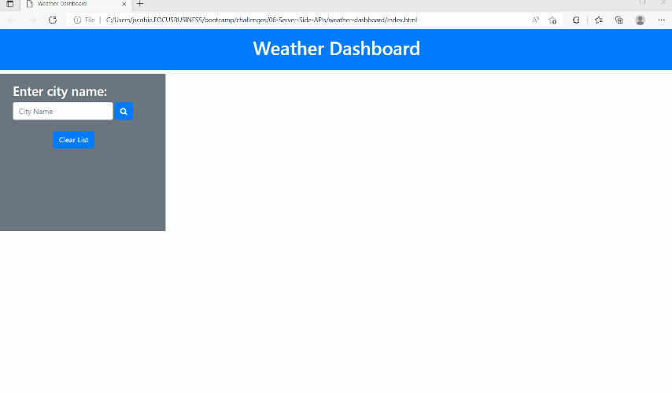

# Challenge 06 Server Side APIs: Weather Dashboard

## Description

This project was built to showcase my ability to supply a working Weather Dashboard using the Openweather API. To complete this I was tasked to use knowledge learned in week 6 along with the previous weeks. The main goal of this assignment is to provide a Weather Dashboard that responds to user inputs and shows todays weather and 5 day forecast.

In this project to build a working Current and 5 future days forecast I utilized HTML, CSS, BootStrap CSS Framework, Moment.JS, and JQuery to build a functioning forecasting site that takes a city input by the user, passes that to the OpenWeatherMap.org API (Server Side API) and uses the API's response to build a forecast display for the user. This also uses local storage to store previously stored searchs for that session. beyond the scope of the project I did include a clear list option button for the user.

## Mock-Up

Github Repository Link: https://github.com/jscobie/weather-dashboard

Deployed page Link: https://jscobie.github.io/weather-dashboard/

The following animation demonstrates the application functionality:



## Installation

Required items are index.html, script.js, and style.css files (assets folder has a js folder for script.js and css folder for style.css).

Additionally to clone to your computer using SSH from GitHub:
```
git clone https://github.com/jscobie/weather-dashboard.git
```

## Usage

The usage of this project is to allow myself to turn this project in for grading to the MSU Bootcamp academic grading team.

## Credits

Credit to the MSU Bootcamp and instructors for training and training materials to resolve some of these issues.
Bootstrap: https://getbootstrap.com/
JQuery: https://jquery.com/
Moment.JS: https://momentjs.com/docs/#/query/
OpenWeatherMap API: https://openweathermap.org/forecast5